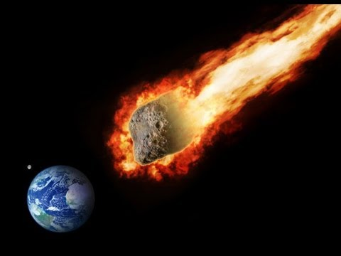

# _The Flaming Space Rocks Tracker!_
  

    
  

#### _Don't Panic! We have made this application specifically for you, the Asteroidphobe!_

#### _We know you wake up in a cold sweat every morning wondering when an asteroid will come careening into your skull, and we've got you covered!_

#### _With our application, you can time your daily activities to coincide with times of safety and security! If you get flattened by an asteroid, let's make sure it's when your alone, and not in the middle of ordering coffee from that cute barista._

 _Made with Angular2 & the NASA NEO (Near Earth Object) API._

 _5-18-17_

#### By _**Shane Stafford, Christian Martinez, Andy Malkin, Jahan Walsh & Evan Bishop**_

<!-- ## Planning

1. Configuration/dependencies

  * Typescript is installed globally
  * Angular2 is installed
  * Node.js is installed globally and modules are included when project is initiated with Angular2
  * Bower is a front-end dependency manager that is installed globally and initiated after project directory is created
  * Bootstrap is a collection of CSS that is installed with Bower, and manually added in angular-cli.json

2. Integration

  * Initiate Project With Angular2
    Generate:
  * welcome component
  * about component
  * admin component
  * links component
  * users-display-list component
  * user-detail component
  * edit-user component
  * user model
  * user service

3. UX/UI

  * Install Bootstrap with Bower

4. Polish

  * Clean up indentation and formatting
  * DRY up code where applicable
  * Make README awesome

5. Ideas For Possible Future Functionality

  * Use YouTube API to include Kendama Channels in the application
  * Use Reddit API to incude posts from the r/Kendama subreddit
  * Filter list of players various ways
    * Skill Ratings
    * Alphabetically
    * Age
    * Location
 -->

## Description

_Using NASA's Near Earth Object Api, we at Space-Team-Besties have built an application that tracks the small dangerous celestial objects near earth for the current day. You will first arrive at the home page and see a series of 'cards', that each contain information for a single near earth object._

_Properties of these objects include: Whether or not they are potentially hazardous, their Approach Date, their Relative Velocity in Miles Per Hour, their Estimated Diameter in Miles, and their Absolute Magnitude (a measurement of true brightness, primarily determined by its size, and by its temperature)._

_You will also notice that each card has a high contrast background color that quickly tells you whether or not the objects are potentially hazardous. Green means your safe, Yellow means you should look more closely! A link is also provided if you would like to gather more specific information from NASA.gov_

  

_Lastly, on the Nav Bar at the top of the page, there is a link to a page of Resources for those inclined, and an About page, if you like to get to know our team!_

  

## Setup/Installation Requirements

* Install Angular2 https://v2.angular.io/docs/ts/latest/
* Install Node.js https://nodejs.org/en/
* Install Bower https://bower.io/
* Download this repository: https://github.com/EB888/kendama-hq-week4js.git
* In the top level of this project directory (downloaded from Github), in Terminal, enter these commands:
 
`npm install`
 
&
 
`bower install`
* Next enter the command
 
`ng serve`
 
* A server will begin running at `localhost:4200`
* In your web browser enter the URL `localhost:4200` to see the page
* Plan your day around the dangerous objects coming in from space!
* Finally, notify us of any bugs : (

## Known Bugs

There are currently no known bugs (5-18-17)

## Support and contact details

_If you have issues, questions, ideas or concerns, please contact us at email@email.com_

## Technologies Used

* Angular2 https://v2.angular.io/docs/ts/latest/
* Typescript http://www.typescriptlang.org/
* Node.js https://nodejs.org/en/
* Bower https://bower.io/
* Materialize http://materializecss.com
* NASA NeoWs https://api.nasa.gov/api.html#NeoWS

### License

Copyright (c) 2017 **_Shane Stafford, Christian Martinez, Andy Malkin, Jahan Walsh & Evan Bishop_**
